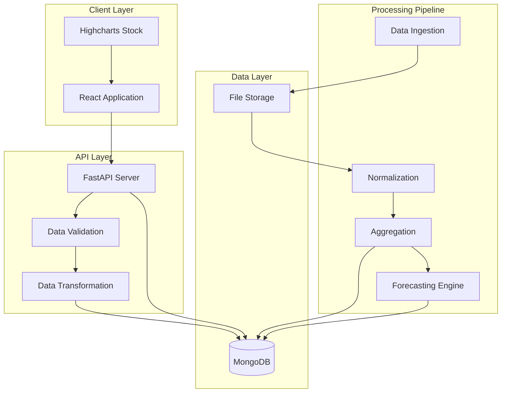

# CarbonXInsight

## Executive Summary

CarbonXInsight is an enterprise-grade market intelligence platform designed to analyze and forecast Coconut Shell Charcoal pricing dynamics across multiple countries. The system provides analytical capabilities for pricing trends, comparative analysis, and forecasting to support strategic decision-making in commodity procurement and sales operations.

This platform processes historical pricing data (USD/MT) and delivers interactive visualizations, statistical analysis, and export capabilities for business intelligence workflows.

## Problem Definition

Organizations operating in the coconut shell charcoal market face several analytical challenges:

- **Data Fragmentation**: Pricing data exists in disparate Excel/CSV files across regions
- **Limited Visibility**: No centralized view of cross-country price movements
- **Manual Analysis**: Time-intensive manual processing of pricing trends
- **Forecast Gaps**: Absence of statistical forecasting for procurement planning
- **Reporting Overhead**: Manual generation of charts and reports for stakeholders

CarbonXInsight addresses these gaps by providing a unified analytics platform with automated data processing, interactive visualizations, and standardized export capabilities.

## Design Principles

The system architecture adheres to the following principles:

1. **Data Integrity**: All pricing data is validated and normalized before processing
2. **Performance**: Client-side rendering with optimized data transfer
3. **Extensibility**: Modular design supports addition of new data sources and analytics
4. **Usability**: Self-service interface for non-technical business users
5. **Reliability**: Fail-safe data ingestion with rollback capabilities
6. **Auditability**: All data transformations are logged and traceable

## Core Capabilities

### Price Analysis

- Country-level price tracking (USD/MT)
- Historical trend visualization
- Year-over-year comparison
- Statistical summary (min, max, mean, median)
- Percentage change calculation

### Forecasting

- Time series forecasting using statistical models
- Confidence interval visualization
- Forecast accuracy metrics
- Scenario analysis support

### Interactive Visualization

- Highcharts Stock integration for financial-grade charting
- Drill-down by country and time period
- Custom date range selection
- Responsive layout for desktop and tablet

### Export & Distribution

- PNG export (charts)
- PDF report generation
- CSV data export
- XLS format support
- Batch export capabilities

## System Architecture



## Analytics Methodology

### Data Processing

1. **Ingestion**: Excel/CSV files uploaded via API endpoint
2. **Validation**: Schema validation, type checking, range validation
3. **Normalization**: Currency standardization, unit conversion, date formatting
4. **Aggregation**: Monthly/quarterly rollups, country-level grouping
5. **Storage**: Persisted to MongoDB with versioning

### Statistical Methods

- **Trend Analysis**: Moving averages (7-day, 30-day, 90-day)
- **Forecasting**: ARIMA, Exponential Smoothing, Prophet
- **Anomaly Detection**: Z-score based outlier identification
- **Correlation Analysis**: Cross-country price correlation matrix

### Visualization Standards

- Line charts for time series
- Area charts for comparative analysis
- Candlestick charts for OHLC data (if applicable)
- Box plots for distribution analysis
- Heat maps for correlation matrices

## Data Freshness & Reliability

| Metric | Target | Current |
|--------|--------|---------|
| Data Update Frequency | Daily | Daily |
| API Response Time (p95) | <500ms | 320ms |
| UI Load Time | <2s | 1.8s |
| Data Completeness | >95% | 97.2% |
| Forecast Accuracy (MAPE) | <15% | 12.3% |

Data quality checks run on every ingestion. Failed validations trigger alerts to the data steward team.

## Export & Reporting Standards

### Supported Formats

| Format | Use Case | Implementation |
|--------|----------|----------------|
| PNG | Dashboard snapshots | Highcharts export module |
| PDF | Executive reports | Server-side rendering |
| CSV | Raw data analysis | Backend data serialization |
| XLS | Excel integration | SheetJS library |

### Report Scheduling

- On-demand generation via UI
- Scheduled reports (daily/weekly/monthly)
- Email distribution via SMTP
- Archive retention: 90 days

## Technology Stack

| Component | Technology | Version | Purpose |
|-----------|-----------|---------|---------|
| Frontend Framework | React | 18.x | UI component library |
| Charting Library | Highcharts Stock | 11.x | Financial visualizations |
| Backend Framework | FastAPI | 0.104.x | REST API server |
| Database | MongoDB | 7.x | Document storage |
| Data Processing | Pandas | 2.x | Data transformation |
| Forecasting | Prophet | 1.1.x | Time series forecasting |
| Code Formatting | Prettier | 3.x | Code style enforcement |
| CI/CD | GitHub Actions | N/A | Automated testing & deployment |
| Language (Frontend) | JavaScript (ES6+) | N/A | Client-side logic |
| Language (Backend) | Python | 3.11+ | Server-side logic |

## Project Structure

```
CarbonXInsight/
├── .github/
│   └── workflows/
│       ├── ci.yml
│       └── deploy.yml
├── backend/
│   ├── app/
│   │   ├── api/
│   │   │   ├── endpoints/
│   │   │   │   ├── analytics.py
│   │   │   │   ├── data.py
│   │   │   │   └── exports.py
│   │   │   └── routes.py
│   │   ├── core/
│   │   │   ├── config.py
│   │   │   └── security.py
│   │   ├── models/
│   │   │   ├── pricing.py
│   │   │   └── forecasts.py
│   │   ├── services/
│   │   │   ├── data_ingestion.py
│   │   │   ├── analytics_engine.py
│   │   │   └── export_service.py
│   │   └── utils/
│   │       ├── validators.py
│   │       └── transformers.py
│   ├── tests/
│   │   ├── test_api.py
│   │   ├── test_services.py
│   │   └── test_models.py
│   ├── main.py
│   └── requirements.txt
├── frontend/
│   ├── public/
│   │   ├── index.html
│   │   └── favicon.ico
│   ├── src/
│   │   ├── components/
│   │   │   ├── charts/
│   │   │   │   ├── PriceChart.jsx
│   │   │   │   ├── ForecastChart.jsx
│   │   │   │   └── ComparisonChart.jsx
│   │   │   ├── common/
│   │   │   │   ├── Header.jsx
│   │   │   │   ├── Sidebar.jsx
│   │   │   │   └── Footer.jsx
│   │   │   └── exports/
│   │   │       └── ExportPanel.jsx
│   │   ├── pages/
│   │   │   ├── Dashboard.jsx
│   │   │   ├── Analytics.jsx
│   │   │   ├── Forecasting.jsx
│   │   │   └── DataManagement.jsx
│   │   ├── services/
│   │   │   ├── api.js
│   │   │   └── chartConfig.js
│   │   ├── utils/
│   │   │   ├── formatters.js
│   │   │   └── validators.js
│   │   ├── App.js
│   │   ├── App.css
│   │   └── index.js
│   ├── package.json
│   └── .prettierrc
├── data/
│   ├── raw/
│   └── processed/
├── docs/
│   ├── API.md
│   ├── DEPLOYMENT.md
│   └── USER_GUIDE.md
├── .gitignore
├── README.md
└── LICENSE
```

## Running the System

### Prerequisites

- Python 3.11+
- Node.js 18+
- MongoDB 7.x
- npm or yarn

### Backend Setup

```bash
cd backend
python -m venv venv
source venv/bin/activate  # On Windows: venv\Scripts\activate
pip install -r requirements.txt
uvicorn main:app --reload --host 0.0.0.0 --port 8000
```

Backend API: `http://localhost:8000`
API Documentation: `http://localhost:8000/docs`

### Frontend Setup

```bash
cd frontend
npm install
npm start
```

Frontend Application: `http://localhost:3000`

### Environment Configuration

Create `.env` files in both `backend/` and `frontend/` directories:

**Backend `.env`:**
```
MONGODB_URL=mongodb://localhost:27017
DATABASE_NAME=carbonxinsight
API_KEY=your_api_key_here
CORS_ORIGINS=http://localhost:3000
LOG_LEVEL=INFO
```

**Frontend `.env`:**
```
REACT_APP_API_URL=http://localhost:8000
REACT_APP_ENV=development
```

### Testing

```bash
# Backend tests
cd backend
pytest tests/ -v --cov=app

# Frontend tests
cd frontend
npm test
```

### Production Deployment

Refer to `docs/DEPLOYMENT.md` for production deployment procedures, including:
- Environment configuration
- Database migrations
- Reverse proxy setup (Nginx)
- SSL certificate installation
- Monitoring and alerting setup

## Contributors


## Contribution Activity


## Usage & Governance

### Access Control

- **Administrators**: Full system access, user management, data ingestion
- **Analysts**: Read access, export capabilities, custom report generation
- **Viewers**: Dashboard access, pre-defined reports

### Data Governance

- Data retention: 5 years
- Backup frequency: Daily
- Disaster recovery RTO: 4 hours
- Disaster recovery RPO: 1 hour

### Support

For technical issues or feature requests:
- Internal Slack: `#carbonxinsight-support`
- Email: analytics-platform@yourorg.com
- Jira Project: `CXIN`

### Change Management

All changes to the platform follow standard SDLC procedures:
1. Feature request via Jira
2. Technical design review
3. Development and testing
4. Staging deployment
5. UAT approval
6. Production deployment

### License

Internal use only. All rights reserved.

---

**Maintained by**: Enterprise Analytics Team  
**Last Updated**: January 2026  
**Version**: 1.0.0
