# CarbonXinsight

A comprehensive sales and marketing analytics tool for HayCarb, enabling real-time tracking and analysis of coconut product pricing, distribution patterns, and market forecasting.

## Overview

CarbonXinsight is a full-stack application designed to streamline sales operations and provide actionable insights through predictive analytics. Built with modern technologies, it delivers a robust platform for data-driven decision-making in the coconut products industry.

## Technology Stack

### Backend
- **Framework:** FastAPI (Python 3.x)
- **API Architecture:** RESTful
- **Data Processing:** Pandas, NumPy
- **Predictive Analytics:** Scikit-learn, Prophet

### Frontend
- **Framework:** React.js
- **Visualization:** Highcharts.js
- **Styling:** CSS3
- **Build Tool:** Webpack

### Languages Distribution
```
JavaScript  65.5%
CSS         21.7%
Python      12.5%
HTML         0.3%
```

## Architecture


## Features

- **Real-time Sales Tracking:** Monitor sales performance across multiple product lines
- **Price Analysis:** Dynamic pricing insights and competitive analysis
- **Distribution Mapping:** Geographical distribution tracking and optimization
- **Predictive Forecasting:** ML-powered sales and demand forecasting
- **Interactive Dashboards:** Customizable data visualization with Highcharts
- **Performance Metrics:** KPI tracking and reporting capabilities

## Project Structure

```
CarbonXinsight/
├── .github/
│   └── workflows/
│       └── python-package-conda.yml    # CI/CD pipeline configuration
├── backend/
│   ├── __pycache__/                    # Python compiled bytecode
│   ├── uploads/                        # File upload storage
│   ├── venv/                           # Virtual environment
│   ├── .env                            # Environment variables
│   ├── db.py                           # Database configuration
│   └── main.py                         # FastAPI application entry
├── frontend/
│   ├── node_modules/                   # NPM dependencies
│   ├── public/                         # Static assets
│   ├── src/                            # React source code
│   ├── .gitignore                      # Git ignore rules
│   ├── eslint.config.js                # ESLint configuration
│   ├── index.html                      # HTML entry point
│   ├── package.json                    # NPM package configuration
│   ├── package-lock.json               # NPM lock file
│   ├── README.md                       # Frontend documentation
│   └── vite.config.js                  # Vite build configuration
└── requirements.txt                    # Python dependencies
```

## System Architecture

```mermaid
%%{init: {'theme':'dark', 'themeVariables': { 'primaryColor':'#2563eb','primaryTextColor':'#fff','primaryBorderColor':'#1e40af','lineColor':'#3b82f6','secondaryColor':'#7c3aed','tertiaryColor':'#0891b2','background':'#1e293b','mainBkg':'#334155','secondBkg':'#475569','tertiaryBkg':'#64748b'}}}%%
graph TB
    subgraph Frontend["🎨 Frontend Layer"]
        direction TB
        HTML[index.html<br/>📄 Entry Point]
        REACT[React Application<br/>⚛️ v18.x]
        COMP[UI Components<br/>🧩 Modular Design]
        API_CLIENT[API Services<br/>🔌 HTTP Client]
        VITE[Vite Build<br/>⚡ Dev Server]
        ESLINT[ESLint<br/>✅ Code Quality]
        
        HTML --> REACT
        REACT --> COMP
        REACT --> API_CLIENT
        VITE -.->|Hot Reload| HTML
        ESLINT -.->|Lint Check| REACT
    end
    
    subgraph Backend["🔧 Backend Layer"]
        direction TB
        MAIN[main.py<br/>🚀 FastAPI App]
        SERVER[FastAPI Server<br/>🌐 REST API]
        DB_LAYER[Database Layer<br/>💾 ORM/SQLAlchemy]
        UPLOAD[Upload Handler<br/>📤 File Processing]
        DB_CONFIG[db.py<br/>⚙️ Configuration]
        VENV[Virtual Env<br/>📦 Dependencies]
        
        MAIN --> SERVER
        SERVER --> DB_LAYER
        SERVER --> UPLOAD
        DB_CONFIG --> DB_LAYER
        VENV -.->|Isolated Deps| MAIN
    end
    
    subgraph Storage["💾 Data Storage"]
        direction LR
        DATABASE[(Database<br/>🗄️ PostgreSQL/MySQL)]
        FILES[/File System<br/>📁 uploads/]
    end
    
    subgraph DevOps["🔄 CI/CD Pipeline"]
        direction TB
        GITHUB[GitHub Actions<br/>🤖 Automation]
        CONDA[Conda Workflow<br/>🐍 python-package-conda.yml]
        TESTS[Test Suite<br/>🧪 pytest + jest]
        
        GITHUB --> CONDA
        CONDA --> TESTS
    end
    
    API_CLIENT ==>|REST API<br/>JSON| SERVER
    DB_LAYER ==>|SQL Queries| DATABASE
    UPLOAD ==>|File I/O| FILES
    CONDA -.->|Deploy| MAIN
    CONDA -.->|Build| VITE
    
    classDef frontendStyle fill:#3b82f6,stroke:#1e40af,stroke-width:3px,color:#fff
    classDef backendStyle fill:#8b5cf6,stroke:#6d28d9,stroke-width:3px,color:#fff
    classDef storageStyle fill:#10b981,stroke:#059669,stroke-width:3px,color:#fff
    classDef devopsStyle fill:#f59e0b,stroke:#d97706,stroke-width:3px,color:#fff
    
    class HTML,REACT,COMP,API_CLIENT,VITE,ESLINT frontendStyle
    class MAIN,SERVER,DB_LAYER,UPLOAD,DB_CONFIG,VENV backendStyle
    class DATABASE,FILES storageStyle
    class GITHUB,CONDA,TESTS devopsStyle
```

<div align="center">



</div>

## Getting Started

### Prerequisites

- Python 3.8 or higher
- Node.js 14.x or higher
- npm or yarn package manager

### Installation

1. Clone the repository
```bash
git clone https://github.com/sadumina/CarbonXinsight-.git
cd CarbonXinsight-
```

2. Backend Setup
```bash
cd backend
pip install -r ../requirements.txt
python main.py
```

3. Frontend Setup
```bash
cd frontend
npm install
npm start
```

### Configuration

Create a `.env` file in the backend directory:
```env
DATABASE_URL=your_database_url
API_KEY=your_api_key
DEBUG=False
```

## API Documentation

Once the backend is running, access the interactive API documentation at:
- Swagger UI: `http://localhost:8000/docs`
- ReDoc: `http://localhost:8000/redoc`

## Deployment

The application includes GitHub Actions workflows for automated deployment. Configure your deployment environment variables in the repository settings.

```mermaid
%%{init: {'theme':'dark', 'themeVariables': { 'primaryColor':'#f59e0b','primaryTextColor':'#000','primaryBorderColor':'#d97706','lineColor':'#fbbf24','secondaryColor':'#10b981','tertiaryColor':'#ef4444','noteBkgColor':'#fef3c7','noteTextColor':'#000'}}}%%
graph TB
    START([Developer Push]) -->|Git Push| TRIGGER{GitHub Actions<br/>🤖 Triggered}
    
    TRIGGER -->|main branch| BUILD[Build Process<br/>🔨 Compile & Bundle]
    TRIGGER -->|other branch| SKIP[Skip Deployment<br/>⏭️ Run Tests Only]
    
    BUILD --> LINT[Code Linting<br/>✅ ESLint + Black]
    LINT --> TEST{Run Tests<br/>🧪 pytest + jest}
    
    TEST -->|❌ Fail| NOTIFY_FAIL[Notify Team<br/>📧 Build Failed]
    TEST -->|✅ Pass| SECURITY[Security Scan<br/>🔒 Dependency Check]
    
    SECURITY --> DOCKER[Build Docker Image<br/>🐳 Containerize]
    DOCKER --> PUSH[Push to Registry<br/>📦 Docker Hub/ECR]
    
    PUSH --> DEPLOY_STAGE[Deploy Staging<br/>🎭 Test Environment]
    DEPLOY_STAGE --> HEALTH{Health Check<br/>💚 Status OK?}
    
    HEALTH -->|❌ Unhealthy| ROLLBACK[Rollback<br/>↩️ Previous Version]
    HEALTH -->|✅ Healthy| SMOKE[Smoke Tests<br/>💨 Critical Paths]
    
    SMOKE -->|❌ Fail| ROLLBACK
    SMOKE -->|✅ Pass| APPROVE{Manual Approval<br/>👨‍💼 Required?}
    
    APPROVE -->|Yes| WAIT[Await Approval<br/>⏳ Review Required]
    APPROVE -->|No| DEPLOY_PROD
    WAIT -->|Approved| DEPLOY_PROD[Deploy Production<br/>🚀 Live Environment]
    
    DEPLOY_PROD --> MONITOR[Monitor Metrics<br/>📊 Performance Check]
    MONITOR --> SUCCESS([Deployment Complete<br/>✨ Success])
    
    ROLLBACK --> NOTIFY_FAIL
    NOTIFY_FAIL --> END([End])
    SUCCESS --> END
    SKIP --> END
    
    classDef startEnd fill:#8b5cf6,stroke:#7c3aed,stroke-width:3px,color:#fff
    classDef process fill:#3b82f6,stroke:#2563eb,stroke-width:2px,color:#fff
    classDef decision fill:#f59e0b,stroke:#d97706,stroke-width:2px,color:#000
    classDef success fill:#10b981,stroke:#059669,stroke-width:3px,color:#fff
    classDef failure fill:#ef4444,stroke:#dc2626,stroke-width:2px,color:#fff
    
    class START,END startEnd
    class BUILD,LINT,DOCKER,PUSH,DEPLOY_STAGE,DEPLOY_PROD,MONITOR,SECURITY,SMOKE,SKIP,WAIT process
    class TRIGGER,TEST,HEALTH,APPROVE decision
    class SUCCESS success
    class NOTIFY_FAIL,ROLLBACK failure
```

<div align="center">



</div>

## Contributing

Contributions are welcome. Please follow these guidelines:

### Contribution Workflow


### Development Process

1. **Fork the repository**
   ```bash
   # Click 'Fork' on GitHub, then clone your fork
   git clone https://github.com/YOUR_USERNAME/CarbonXinsight-.git
   ```

2. **Create a feature branch**
   ```bash
   git checkout -b feature/your-feature-name
   ```

3. **Set up development environment**
   ```bash
   # Backend
   cd backend
   python -m venv venv
   source venv/bin/activate  # On Windows: venv\Scripts\activate
   pip install -r ../requirements.txt
   
   # Frontend
   cd ../frontend
   npm install
   ```

4. **Make your changes**
   - Write clean, documented code
   - Follow existing code style
   - Add tests for new features

5. **Test your changes**
   ```bash
   # Backend tests
   cd backend
   pytest
   
   # Frontend tests
   cd frontend
   npm test
   npm run lint
   ```

6. **Commit with clear messages**
   ```bash
   git add .
   git commit -m "feat: add new analytics dashboard component"
   ```

7. **Push and create Pull Request**
   ```bash
   git push origin feature/your-feature-name
   ```

### Commit Message Convention

Follow conventional commits format:
- `feat:` New feature
- `fix:` Bug fix
- `docs:` Documentation changes
- `style:` Code style changes (formatting)
- `refactor:` Code refactoring
- `test:` Adding tests
- `chore:` Maintenance tasks

### Code Standards

- **Python:** Follow PEP 8, use type hints
- **JavaScript:** Follow ESLint configuration
- **Components:** Use functional components with hooks
- **Testing:** Maintain minimum 80% code coverage
- **Documentation:** Update README and inline comments

## Testing

### Backend Tests
```bash
cd backend
pytest tests/
```

### Frontend Tests
```bash
cd frontend
npm test
```

## Performance

The application is optimized for:
- Response time: < 200ms for API calls
- Data processing: Handles datasets up to 1M records
- Concurrent users: Supports 100+ simultaneous connections

## License

This project is proprietary software developed for HayCarb.

## Contact

**Project Maintainer:** Sadumina Bagya  
**Repository:** [github.com/sadumina/CarbonXinsight-](https://github.com/sadumina/CarbonXinsight-)

## Acknowledgments

Built for HayCarb sales and marketing operations to enhance data-driven decision-making in the coconut products industry.

---

For issues and feature requests, please use the [GitHub Issues](https://github.com/sadumina/CarbonXinsight-/issues) page.
